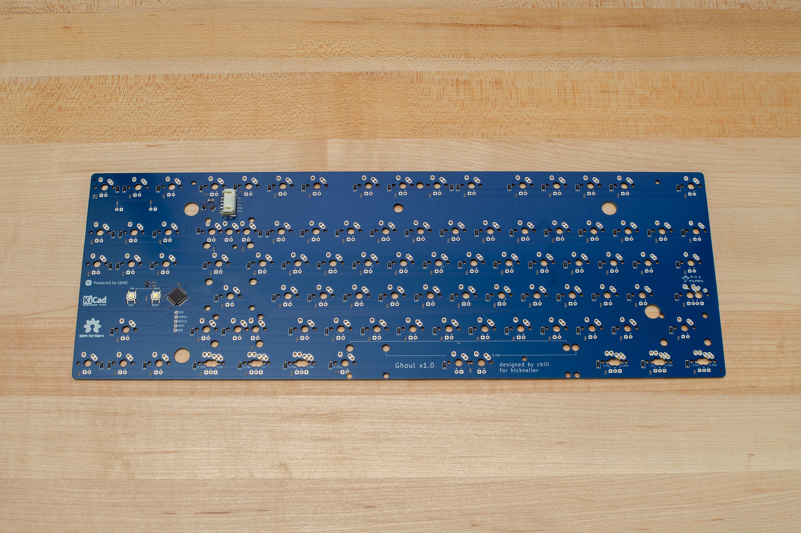
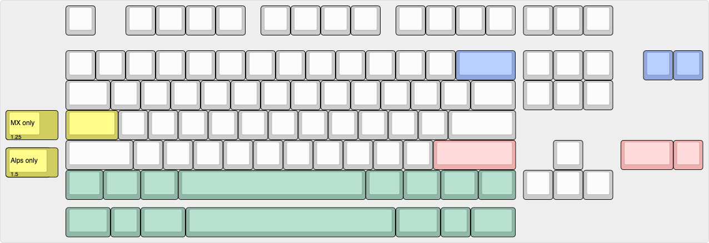

# Ghoul TKL PCB

A modern replacement PCB for Filco TKLs, adding support for PCB-mount stabilizers and popular alternate layouts. In-switch backlight LEDs are also supported.

[Preview the design on KiCanvas](https://kicanvas.org/?github=https://github.com/chillKB/ghoulTKL)

## Features
- Confirmed to fit in Filco Majestouch 2 and 3 TKLs, *likely* supports additional cases including Cooler Master QuickFire TKL (UNCONFIRMED)
- Powered by STM32F072 MCU, supports QMK firmware
- PCB-mount stabilizer support (requires modified plate)
- Multi-layout (see below)
- Backlighting with in-switch single-color LEDs
- Alps switch support (untested, requires modified plate)

## Additional Components
- 1x OEM JST-PH 5-pin to USB cable
- 2x 3mm indicator LEDs
- 2x [LED spacers](https://octopart.com/7362-keystone-87956)
- 89x 1.8mm backlight LEDs (optional)

## Acknowledgements

Special thanks to hickneller for commissioning this PCB and agreeing to open-source it.

Additionally, thanks/credit to
- [KiCad EDA](https://www.kicad.org/)
- [QMK Firmware](https://qmk.fm/)
- [Keyboard Layout Editor](https://www.keyboard-layout-editor.com/)
- kkatano for the [Yurei](https://github.com/kkatano/yurei) PCB, from which this project borrows dimensions needed for physical compatibility
- bpiphany for the Phantom PCB, which is the original Filco replacement PCB
- ebastler for [marbastlib](https://github.com/ebastler/marbastlib), my preferred keyboard library for KiCad
- Zykrah for [tools](https://zykrah.me/) and [references](https://guide.zykrah.me/) that I use often